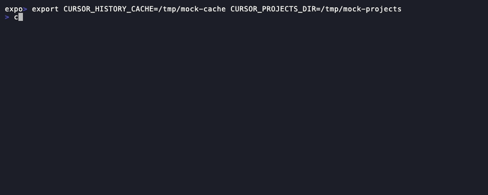
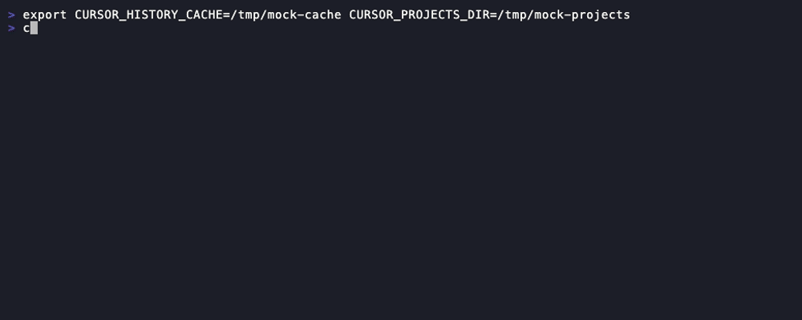
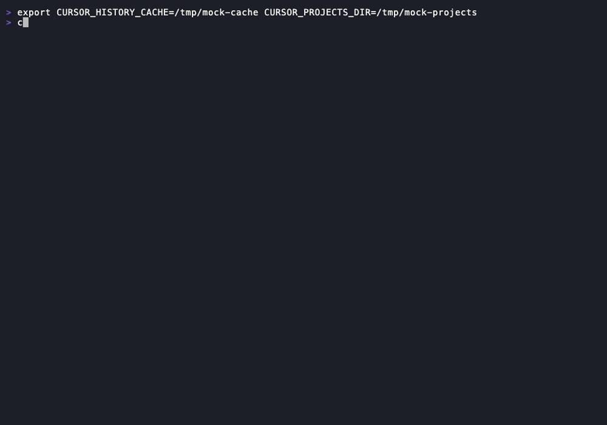

<div align="center">

# cursor-history

**Session management for the [Cursor Agent CLI](https://docs.cursor.com/agent)**

Browse, search, and resume your past agent sessions across every workspace — all from a single terminal command. Never lose track of a conversation again.

[](LICENSE)


</div>

---

## The problem

Every time you run `cursor-agent`, a session transcript is saved under `~/.cursor/projects/` — but there's no built-in way to find or revisit them. The `--resume` flag only works if you remember the session ID and are already in the right directory. The folder names use an encoded format (`Users-jane-doe-projects-my-api`) that hides the original workspace path. After a few days of heavy usage, you're left with dozens of scattered transcripts and no way to navigate them.

## The solution

`cursor-history` scans all your Cursor Agent transcripts, reconstructs the original workspace paths, and gives you a fast, interactive interface to browse, search, and resume any session — regardless of which directory you're in.

### What you get

- **Interactive fuzzy picker** — powered by `fzf` with a live preview pane showing session details and conversation history
- **Full-text search** — find any session by searching across all transcript content, ranked by relevance
- **One-command resume** — select a session and it opens a new terminal tab, `cd`s to the workspace, and resumes the agent automatically
- **Token usage tracking** — estimated input/output token counts per session and in aggregate, so you can see how much you're using
- **Model attribution** — see which model was used for each session, pulled from Cursor's tracking database
- **Stats dashboard** — workspace breakdowns, model usage, activity timelines, and your largest sessions at a glance
- **Smart caching** — the session index rebuilds automatically when new transcripts appear, no manual refresh needed

Everything runs locally. No network calls, no telemetry, no external services. Your transcripts are never modified.

---

## Installation

### Homebrew (recommended)

```bash
brew tap nick-fullpath/tap
brew install cursor-history
```

**Upgrade:**

```bash
brew update && brew upgrade cursor-history
```

If `brew upgrade` shows "already installed", force a fresh pull of the tap:

```bash
brew untap nick-fullpath/tap && brew tap nick-fullpath/tap
brew upgrade cursor-history
```

### One-liner

```bash
curl -fsSL https://raw.githubusercontent.com/nick-fullpath/cursor-history/main/install-remote.sh | bash
```

Re-run the same command to upgrade.

### Manual

```bash
git clone https://github.com/nick-fullpath/cursor-history.git
cd cursor-history
./install.sh           # install to ~/.local/bin
./install.sh --link    # symlink instead (for development)
```

Upgrade with `git pull && ./install.sh`, or use `--link` so the symlink picks up changes automatically.

### Dependencies

`jq`, `fzf`, `python3`, and `bc`. Homebrew installs these automatically. Otherwise:

```bash
brew install jq fzf python3
```

### Shell integration

Add this to your `~/.zshrc` or `~/.bashrc` to enable workspace-aware resume in a new terminal tab:

```bash
eval "$(cursor-history init zsh)"
```

---

## Usage

### Interactive picker

The default command opens a fuzzy-searchable session list with a live preview pane:

```bash
cursor-history
```


### List sessions

View sessions as a table, filter by workspace, or export as JSON:

```bash
cursor-history list                  # all sessions (limit: 50)
cursor-history list -w my-api        # filter by workspace
cursor-history list -n 10            # limit results
cursor-history list --json           # structured output for scripting
```



### Search

Full-text search across all transcript content, ranked by number of matches:

```bash
cursor-history search "rate limiting"
```



### Stats dashboard

See your usage at a glance — sessions, tokens, models, workspaces, and activity over time:

```bash
cursor-history stats
```



### Show & resume

Inspect a session's details and conversation history, or resume it directly. Partial IDs are supported:

```bash
cursor-history show a1b2
cursor-history resume a1b2
```


With shell integration enabled, `resume` opens a new terminal tab, `cd`s to the original workspace, and launches `cursor-agent --resume` automatically.

### All commands

| Command | Description |
|---------|-------------|
| `cursor-history` | Interactive session picker (default) |
| `cursor-history list` | List sessions (`-w`, `-n`, `--json`, `--rebuild`) |
| `cursor-history search <query>` | Full-text search across all transcripts |
| `cursor-history resume <id>` | Resume a session (partial ID supported) |
| `cursor-history show <id>` | Display session details and conversation |
| `cursor-history stats` | Usage statistics dashboard |
| `cursor-history rebuild` | Force-rebuild the session index |

---

## How it works

Cursor encodes workspace paths by replacing `/` and `.` with `-` in the project folder name. For example, `/Users/jane.doe/projects/my-api` becomes `Users-jane-doe-projects-my-api`. Since `-` can also appear as a literal character in directory names, naive string replacement is insufficient.

`cursor-history` resolves this with a DFS algorithm that evaluates all possible separator assignments (`/`, `.`, `-`) at each dash boundary and validates candidates against the actual filesystem.

```
~/.cursor/projects/
├── Users-jane-doe-projects-my-api/
│   └── agent-transcripts/
│       ├── a1b2c3d4-...jsonl
│       └── e5f6a7b8-...txt
├── Users-jane-doe-projects-infra/
│   └── agent-transcripts/
│       └── ...
└── ...
```

**Pipeline:**

1. **Discovery** — Scan `agent-transcripts/` directories under `~/.cursor/projects/`
2. **Path resolution** — Reconstruct workspace paths via filesystem-validated DFS
3. **Parsing** — Extract prompts, message/tool counts, and estimate token usage from `.jsonl` and `.txt` transcripts
4. **Model attribution** — Pull model name and code-edit counts from Cursor's tracking database
5. **Indexing** — Cache at `~/.cursor-history/sessions.json` (auto-invalidated when transcripts change)
6. **Presentation** — Render via `fzf` for interactive use, or as JSON/table for scripting

**Project structure:**

```
cursor-history/
├── cursor-history       # CLI entrypoint (bash)
├── lib/
│   └── indexer.py       # Session indexer (Python)
├── tests/
│   ├── test_indexer.py  # Python unit tests (38 tests)
│   └── test_cli.sh      # Bash integration tests (86 tests)
├── install.sh
├── install-remote.sh
└── README.md
```

## Testing

The project includes 124 tests across two test suites.

**Python unit tests** (`tests/test_indexer.py`) — 38 tests covering:

- DFS path reconstruction (filesystem validation, dot handling, var-prefix, fallback)
- JSONL transcript parsing (messages, tool calls, summaries, HTML stripping, truncation)
- TXT transcript parsing (user_query tags, role markers, fallback summary)
- Token estimation (chars-per-token ratio, input/output separation)
- Transcript preview rendering (JSONL, TXT, limit enforcement, missing files)
- Model map loading (mock SQLite DB, multi-model sessions, missing DB)
- Full build_index pipeline (end-to-end, sort order, file filtering, permissions, model merge)

**Bash integration tests** (`tests/test_cli.sh`) — 86 tests covering:

- All CLI commands: `version`, `help`, `list`, `show`, `resume`, `search`, `stats`, `rebuild`, `init`
- Flag handling: `-n`, `-w`, `--json`, `--rebuild`, `-v`, `-h`
- Error handling: invalid IDs, unknown flags, unexpected arguments, missing parameters
- Cache invalidation: fresh cache reuse, rebuild after transcript directory changes

Run them:

```bash
# Python unit tests
python3 -m unittest tests.test_indexer -v

# Bash integration tests
bash tests/test_cli.sh
```

No external test dependencies are required — both suites use only the standard library and the tools already required by cursor-history (`jq`, `fzf`, `python3`, `bc`).

## Configuration

| Variable | Default | Description |
|----------|---------|-------------|
| `CURSOR_PROJECTS_DIR` | `~/.cursor/projects` | Cursor project data directory |
| `CURSOR_HISTORY_CACHE` | `~/.cursor-history` | Index cache directory |

## Security

- **Read-only** — transcript files are never modified
- **Local-only** — no network calls, telemetry, or external services
- **Restricted cache** — index files are created with `0600` permissions
- **Command validation** — resume commands are validated against an allowlist regex before execution
- **Input sanitization** — session IDs are validated as hex/UUID; numeric parameters are checked before interpolation
- **AppleScript escaping** — user content is sanitized before embedding in AppleScript to prevent injection

## License

[MIT](LICENSE)
